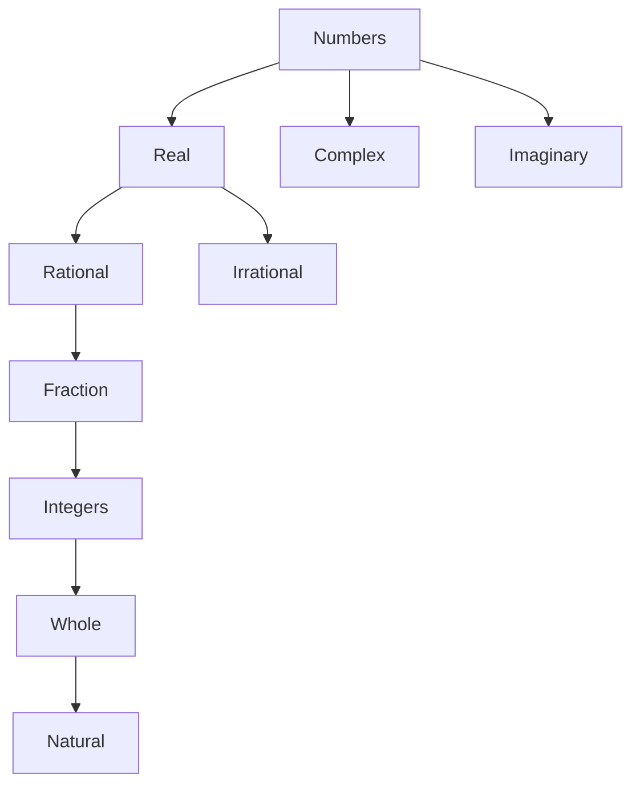

`Fahim Muntasir`
# Pre-Calculus
## Contents
- [[#Week 1 Part 1]]
- [[#Week 1 Part 2]]
- [[#Week 2 Part 1]]
## Week 1 Part 1
#### Types of numbers

#### Cartesian coordinate system
The x coordinate of a point is called its *abscissa*
The y coordinate of a point is called its *ordinate*
#### Formula for finding the distance between points
If D is the distance between two points A (x1,y1) and B (x2,y2);
##### D(A, B) = $\sqrt{(x_2 - x_1)^2+(y_2 - y_1)^2}$

#### Formula for finding the midpoint between two points
If point M (x,y) is the midpoint of the line connecting points P1(x1,y1) and P2(x2,y2);
##### M -> (x,y) = ($\frac{x_2 + x_1}{2}$ , $\frac{y_2 + y_1}{2}$)
## Week 1 Part 2
#### Testing symmetry of a function

Check if a function is symmetric with respect to the x axis:
- Replace all occurrences of $y$ with $-y$ and check if the newly formed equation is identical to the original equation or not
Check if a function is symmetric with respect to the y axis:
- Replace all occurrences of $x$ with $-x$ and check if the newly formed equation is identical to the original equation or not
Check if a function is symmetric with respect to the origin:
- Replace all occurrences of $x$ with $-x$ and all occurrences of $y$ with $-y$, then check if the newly formed equation is identical to the original equation or not

## Week 2 Part 1
