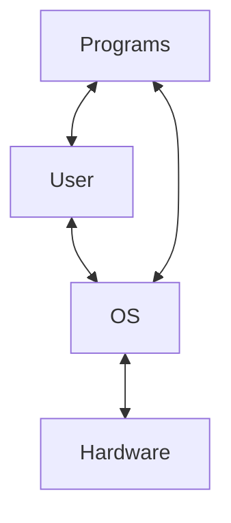
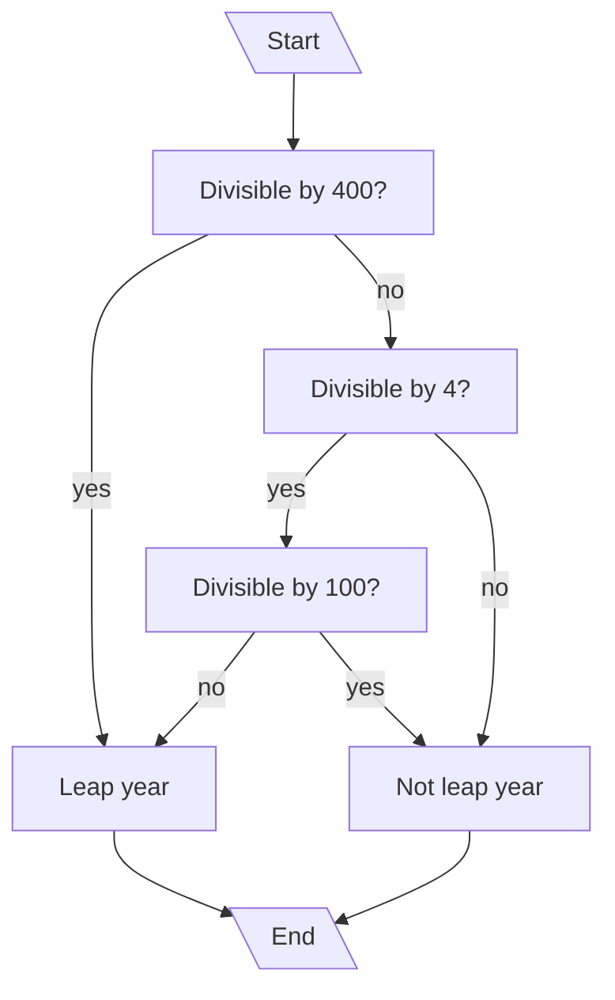
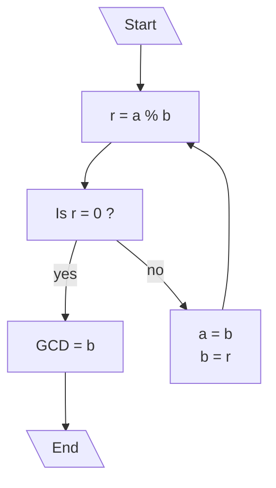

---
tags:
  - CSE215
  - NSU
  - JAVA
Relations:
  - "[[215]]"
  - "[[215_Book.pdf]]"
---

### Types of languages
- Machine Language : Primitive instructions built into every computer, it is written in binary.
- Assembly Language : Used to make machine code readable, an assembler converts assembly to machine code.
- High level languages : Human readable language that is converted to machine code using a compiler/interpreter.
### Difference between interpreter and compiler

| Feature        | Interpreter                      | Compiler                                  |
| -------------- | -------------------------------- | ----------------------------------------- |
| Execution      | line by line                     | all at once                               |
| Run-time       | Slow                             | Fast                                      |
| Frequency      | Has to be interpreted every time | Compiled once                             |
| Error handling | Program terminates at any error  | All errors are reported after compilation |
|                |                                  |                                           |

### Operating systems
The layer connecting the user to the hardware

### Important java characteristics

- Object oriented
- Fast runtime
- Architecture neutral
- Robust exception handling

### Types of errors

- Syntax errors 
- Semantic errors
- Runtime errors
- Logic errors

### Data types with size
- byte - 8 bit
- short - 16 bit
- int - 32 bit
- long - 64 bit
- float - 32 bit
- double - 64 bit

For an n-bit number, the range would be $$[-2^{(n-1)}] \text{ to }[+2^{(n-1)}-1]$$
### Miscellaneous algorithms

- Leap year : `x` is a leap year if

```java
if((x%4==0&&x%100!=0)||(x%400==0)){
//leap year
}else{
//not leap year
}
```
- GCD of two numbers (Euclid's algorithm) : if `a` and `b` are two numbers the `gcd(a,b)` is

```java
int gcd(int a, int b){
	int r;
	r = a % b;
	while(r != 0){
		a = b;
		b = r;
		r = a % b;
	}
	return b;
}
```

### String Methods
| Method                                                                                     | Description                                                                                                          | Return Type  |
| ------------------------------------------------------------------------------------------ | -------------------------------------------------------------------------------------------------------------------- | ------------ |
| [charAt()](https://www.w3schools.com/java/ref_string_charat.asp)                           | Returns the character at the specified index (position)                                                              | char         |
| [compareTo()](https://www.w3schools.com/java/ref_string_compareto.asp)                     | Compares two strings lexicographically                                                                               | int          |
| [compareToIgnoreCase()](https://www.w3schools.com/java/ref_string_comparetoignorecase.asp) | Compares two strings lexicographically, ignoring case differences                                                    | int          |
| [concat()](https://www.w3schools.com/java/ref_string_concat.asp)                           | Appends a string to the end of another string                                                                        | String       |
| [contains()](https://www.w3schools.com/java/ref_string_contains.asp)                       | Checks whether a string contains a sequence of characters                                                            | boolean      |
| [contentEquals()](https://www.w3schools.com/java/ref_string_contentequals.asp)             | Checks whether a string contains the exact same sequence of characters of the specified CharSequence or StringBuffer | boolean      |
| [copyValueOf()](https://www.w3schools.com/java/ref_string_copyvalueof.asp)                 | Returns a String that represents the characters of the character array                                               | String       |
| [equalsIgnoreCase()](https://www.w3schools.com/java/ref_string_equalsignorecase.asp)       | Compares two strings, ignoring case considerations                                                                   | boolean      |
| [getChars()](https://www.w3schools.com/java/ref_string_getchars.asp)                       | Copies characters from a string to an array of chars                                                                 | void         |
| [indexOf()](https://www.w3schools.com/java/ref_string_indexof.asp)                         | Returns the position of the first found occurrence of specified characters in a string                               | int          |
| [isEmpty()](https://www.w3schools.com/java/ref_string_isempty.asp)                         | Checks whether a string is empty or not                                                                              | boolean      |
| [lastIndexOf()](https://www.w3schools.com/java/ref_string_lastindexof.asp)                 | Returns the position of the last found occurrence of specified characters in a string                                | int          |
| [length()](https://www.w3schools.com/java/ref_string_length.asp)                           | Returns the length of a specified string                                                                             | int          |
| [replaceAll()](https://www.w3schools.com/java/ref_string_replaceall.asp)                   | Replaces each substring of this string that matches the given regular expression with the given replacement          | String       |
| [replace()](https://www.w3schools.com/java/ref_string_replace.asp)                         | Searches a string for a specified value, and returns a new string where the specified values are replaced            | String       |
| [replaceFirst()](https://www.w3schools.com/java/ref_string_replacefirst.asp)               | Replaces the first occurrence of a substring that matches the given regular expression with the given replacement    | String       |
| [split()](https://www.w3schools.com/java/ref_string_split.asp)                             | Splits a string into an array of substrings                                                                          | String[]     |
| [startsWith()](https://www.w3schools.com/java/ref_string_startswith.asp)                   | Checks whether a string starts with specified characters                                                             | boolean      |
| [subSequence()](https://www.w3schools.com/java/ref_string_subsequence.asp)                 | Returns a new character sequence that is a subsequence of this sequence                                              | CharSequence |
| [substring()](https://www.w3schools.com/java/ref_string_substring.asp)                     | Returns a new string which is the substring of a specified string                                                    | String       |
| [toCharArray()](https://www.w3schools.com/java/ref_string_tochararray.asp)                 | Converts this string to a new character array                                                                        | char[]       |
| [toLowerCase()](https://www.w3schools.com/java/ref_string_tolowercase.asp)                 | Converts a string to lower case letters                                                                              | String       |
| [toString()](https://www.w3schools.com/java/ref_string_tostring.asp)                       | Returns the value of a String object                                                                                 | String       |
| [toUpperCase()](https://www.w3schools.com/java/ref_string_touppercase.asp)                 | Converts a string to upper case letters                                                                              | String       |
| [trim()](https://www.w3schools.com/java/ref_string_trim.asp)                               | Removes whitespace from both ends of a string                                                                        | String       |
### Math Methods
| Method                                                         | Description                                                | Return Type              |
| -------------------------------------------------------------- | ---------------------------------------------------------- | ------------------------ |
| [abs(x)](https://www.w3schools.com/java/ref_math_abs.asp)      | Returns the absolute value of x                            | double\|float\|int\|long |
| [ceil(x)](https://www.w3schools.com/java/ref_math_ceil.asp)    | Returns the value of x rounded up to its nearest integer   | double                   |
| [exp(x)](https://www.w3schools.com/java/ref_math_exp.asp)      | Returns the value of Ex                                    | double                   |
| [floor(x)](https://www.w3schools.com/java/ref_math_floor.asp)  | Returns the value of x rounded down to its nearest integer | double                   |
| [log(x)](https://www.w3schools.com/java/ref_math_log.asp)      | Returns the natural logarithm (base E) of x                | double                   |
| [log10(x)](https://www.w3schools.com/java/ref_math_log10.asp)  | Returns the base 10 logarithm of x                         | double                   |
| [max(x, y)](https://www.w3schools.com/java/ref_math_max.asp)   | Returns the number with the highest value                  | double\|float\|int\|long |
| [min(x, y)](https://www.w3schools.com/java/ref_math_min.asp)   | Returns the number with the lowest value                   | double\|float\|int\|long |
| [pow(x, y)](https://www.w3schools.com/java/ref_math_pow.asp)   | Returns the value of x to the power of y                   | double                   |
| [random()](https://www.w3schools.com/java/ref_math_random.asp) | Returns a random number between 0 and 1                    | double                   |
| [round(x)](https://www.w3schools.com/java/ref_math_round.asp)  | Returns the value of x rounded to its nearest integer      | long\|int                |
| [sqrt(x)](https://www.w3schools.com/java/ref_math_sqrt.asp)    | Returns the square root of x                               | double                   |
| [cbrt(x)](https://www.w3schools.com/java/ref_math_cbrt.asp)    | Returns the cube root of x                                 | double                   |
| [sin(x)](https://www.w3schools.com/java/ref_math_sin.asp)      | Returns the sine of x (x is in radians)                    | double                   |
| [cos(x)](https://www.w3schools.com/java/ref_math_cos.asp)      | Returns the cosine of x (x is in radians)                  | double                   |
| [tan(x)](https://www.w3schools.com/java/ref_math_tan.asp)      | Returns the tangent of an angle                            | double                   |
| [tanh(x)](https://www.w3schools.com/java/ref_math_tanh.asp)    | Returns the hyperbolic tangent of a double value           | double                   |

### Array Methods
| Method                                                             | Description                                                                               |
| ------------------------------------------------------------------ | ----------------------------------------------------------------------------------------- |
| [compare()](https://www.w3schools.com/java/ref_arrays_compare.asp) | Compares two arrays                                                                       |
| copyOf()                                                           | Creates a copy of an array with a new length                                              |
| deepEquals()                                                       | Compares two multidimensional arrays to check whether they are deeply equal to each other |
| [equals()](https://www.w3schools.com/java/ref_arrays_equals.asp)   | Checks if two arays are equal                                                             |
| [fill()](https://www.w3schools.com/java/ref_arrays_fill.asp)       | Fills an array with a specified value                                                     |
| mismatch()                                                         | Returns the index position of the first mismatch/conflict between two arrays              |
| [sort()](https://www.w3schools.com/java/ref_arrays_sort.asp)       | Sorts an array in ascending order                                                         |


