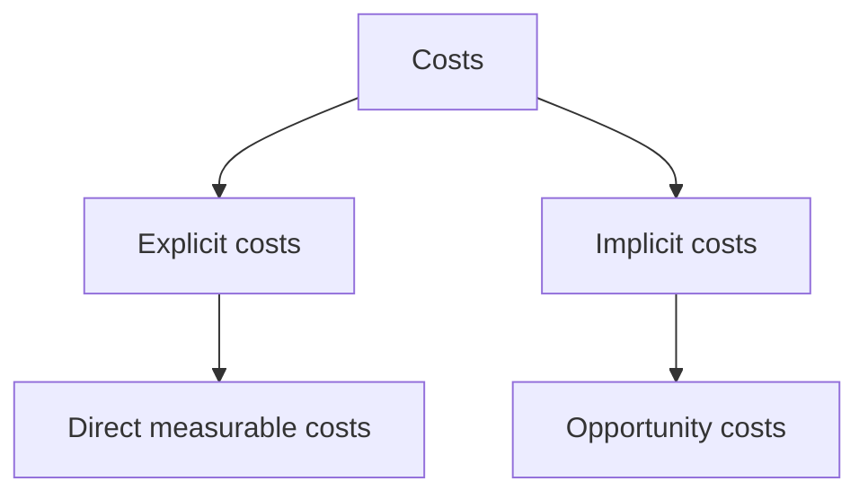
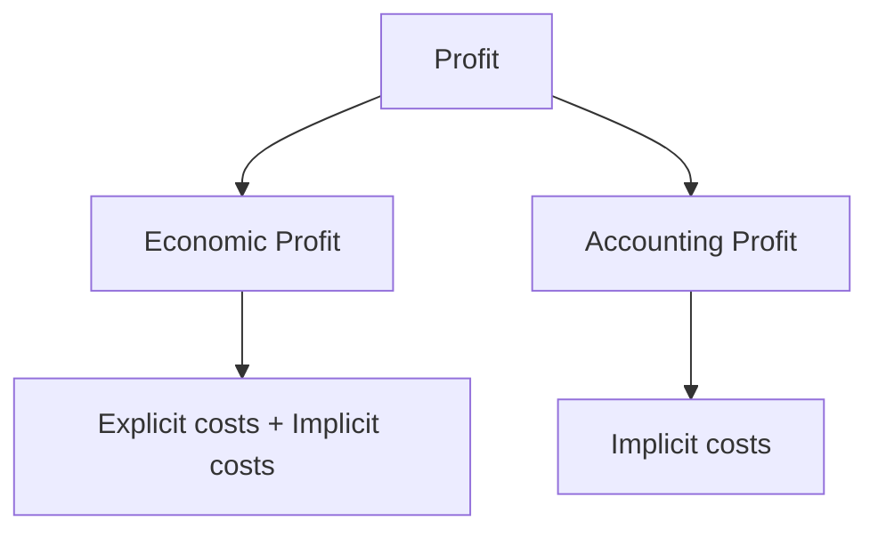
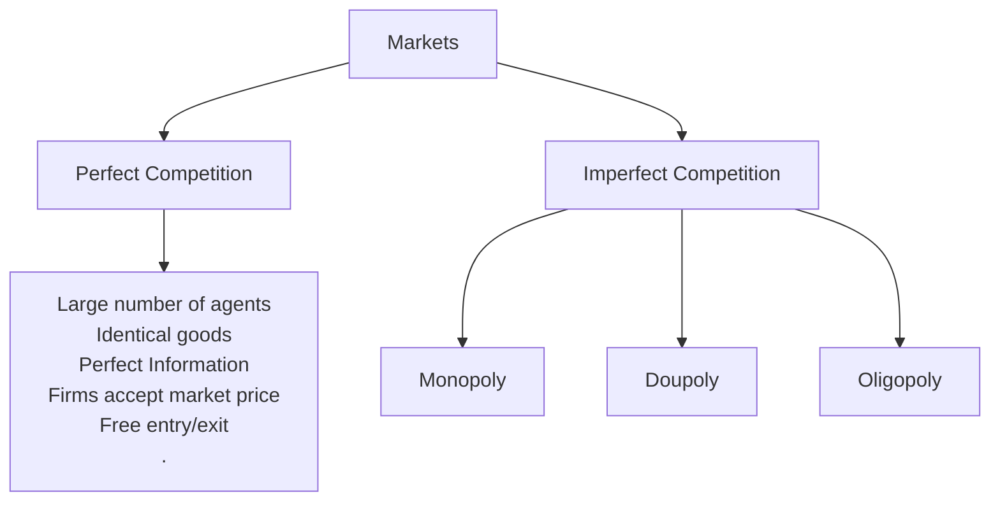

# Production and costs
Total Revenue : The amount a firm receives for sale of its product 
Total Cost : The amount a firm pays to buy its inputs 
$$\text{Profit = Total Revenue - Total Cost}$$

Average Fixed Cost :
$$AFC = \frac{\text{Fixed Costs}}{\text{Quantity}}$$
Average Variable Cost : 
$$AVC = \frac{\text{Variable Cost}}{\text{Quantity}}$$Average Total Cost :
$$ATC = \frac{\text{Total Cost}}{\text{Quantity}}$$
$$ATC = AFC + AVC$$
Marginal Cost : $$MC=\frac{\Delta TC}{\text{Quantity}}$$
Key takeaways:
- Shape of Marginal cost curve
	1. $MC$ is proportional to production as additional workers have a lower marginal product, resulting in less efficient working conditions
- Shape of Average Fixed Cost
	1. As $FC$ is constant in the short run, increase in quantity decreases $AFC$ 
- Shape of Average Variable Cost
	1. Each product has a variable cost which is why $AVC$ increases with quantity
- Shape of Average Total Cost
	1. At low output $AFC$ is high which brings $ATC$ up
	2. As $AFC$ decreases, $ATC$ also decreases
	3. $ATC$ keeps decreasing until $AVC$ becomes significant, which starts increasing $ATC$

`In the short run atleast one factor of production is fixed, the ATC curve in the short run is steeper`
`In the long run all factors are variable, the ATC curve in the long run is flatter`

Economies of Scale
`At lower production levels,`
$$ATC\text{ inversely proportional to quantity}$$
Constant returns to Scale
`At intermediate production levels`
$$ATC \text{ is not affected by quantity}$$
Diseconomies of Scale
`At higher production levels,`
$$ATC\text{ directly proportional to quantity}$$

# Perfect Competition

Total Revenue$$TR = \text{Price}\times \text{Quanitity}$$
Marginal Revenue$$MR=\frac{\Delta TR}{\Delta\text{Quanitity}}$$Average Revenue$$AR=\frac{TR}{\text{Quantity}}$$
Relation between Marginal Revenue and Marginal Cost
- $MR = MC$
	- Maximum Profit
- $MR > MC$
	- Increase output
- $MR<MC$ 
	- Decrease output

Relation between Price and Cost
- Short-run : Shut down if $P<AVC$
- Long-run : Shut down if $P< ATC$ 
- $P = ATC$ : Zero economic profit

Profit$$\text{Profit} = (P-ATC)\times Q$$
# Monopoly
A monopoly exists when a single firm is the sole seller of a product with no close substitutes

Reasons for a monopoly
- Resources : Control over a critical resource
- Government Regulation : Exclusive rights granted to a firm
- Natural Monopoly : Cost efficiency from a single producer due to economies of scale

Characteristics of a monopoly
- **Single Seller**: Complete market control.
- **No Close Substitutes**: Limited consumer choice.
- **High Barriers to Entry**: Economic, legal, or technological obstacles.
- **Price Maker**: Ability to set prices.
- **Limited Consumer Choice**: Higher prices and reduced output compared to competitive markets.

#### **Demand Curves**

- **Perfect Competition**: Horizontal (price taker).
- **Monopoly**: Downward sloping (price maker). Monopolists lower prices to sell more, leading to marginal revenue being less than price (MR<PMR < PMR<P).

#### **Revenue in Monopoly**

- **Total Revenue (TR)**: P×QP \times QP×Q (Price × Quantity).
- **Average Revenue (AR)**: Equal to price.
- **Marginal Revenue (MR)**: Additional revenue from selling one more unit; always less than price.

#### **Profit Maximization**

- Monopolies maximize profit by producing at MR=MCMR = MCMR=MC (Marginal Revenue = Marginal Cost).
- **Steps**:
    1. Determine quantity (QQQ) where MR=MCMR = MCMR=MC.
    2. Set the price (PPP) from the demand curve corresponding to QQQ.
    3. Profit is calculated as (P−ATC)×Q(P - ATC) \times Q(P−ATC)×Q.

#### **Welfare Loss**

- **Socially Efficient Output**: Occurs where the demand curve intersects the marginal cost curve.
- **Deadweight Loss**: Created by monopolies due to reduced output and higher prices, leading to loss of total surplus.

#### **Price Discrimination**

- Charging different prices to customers based on willingness to pay.
- **Conditions**:
    1. Ability to segment customers.
    2. Prevent resale of goods/services.

#### **Regulations for Monopolies**

1. **Antitrust Policies**: Breaking monopolies, preventing mergers, and prohibiting anti-competitive practices.
2. **Regulation**: Price controls, quality standards, and rate-of-return regulation.
3. **Public Ownership**: Government ownership of industries to ensure fair pricing and efficiency.