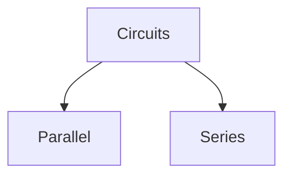

# Types of Electrical Circuits
---
**Current** : Current is defined as the flow of charged particles
$$I=\frac{Q}{T}$$
**EMF** : Electro-motive force (EMF) is defined as the work done per unit charge in a circuit $$V=\frac{W}{Q}$$
**Resistance** : Ratio of voltage and current passing through two points$$R=\frac{V}{I}\;$$
A **branch** is a single 
A **node** is the junction where multiple branches move 

Types of circuits :
 - Series : When elements carry the same current and share the same branch 
 - Parallel : When elements have the same voltage across them and connect to the same two nodes

Total resistance of a series circuit:$$R_T=R_1+R_2+R_3+...+R_n$$
Total resistance of a parallel circuit:$$\frac{1}{R_T}=\frac{1}{R_1}+\frac{1}{R_2}+\frac{1}{R_3}+...+\frac{1}{R_n}$$

|            | Series                                         | Parallel                                                                    |
| ---------- | ---------------------------------------------- | --------------------------------------------------------------------------- |
| Current    | Constant across elements (Charge is conserved) | Split across junctions according to resistance                              |
| Voltage    | Split across elements according to resistance  | Constant across Branches (Energy is conserved)                              |
| Resistance | $R_T=R_1+R_2+R_3+...+R_n$                      | $\frac{1}{R_T}=\frac{1}{R_1}+\frac{1}{R_2}+\frac{1}{R_3}+...+\frac{1}{R_n}$ |
Power:
$$P=\frac{W}{T}; W=VQ$$
$$P=\frac{VQ}{T}$$
$$\therefore P=IV=I^2R=\frac{V^2}{R}$$
Kirchhoff's voltage law : Sum of potential differences in a closed loop will always equal zero

Voltage Divider formula:$$V_x=R_x\frac{E}{R_T}$$
