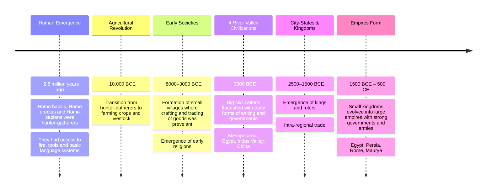
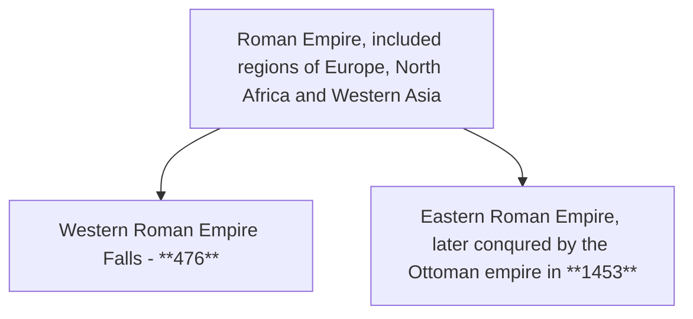
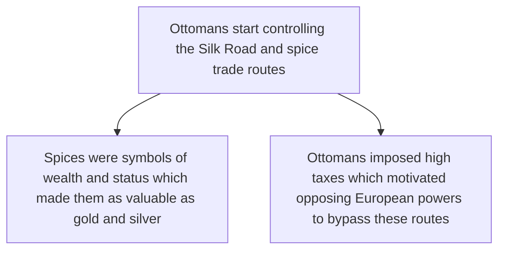

`Fahim Muntasir`

## From trader to ruler
##### History of early civilizations

- This motivated European powers to find direct sea routes to Asia, bypassing Ottoman control.
    
- Technological advancements in cartography and astronomy during the 15th and 16th centuries enabled long-distance exploration.
    
- In 1492, Columbus attempted to reach Asia but landed in the Americas, calling it the "West Indies."
    
- Vasco da Gama successfully reached India by sea (1497–1499), establishing new maritime trade routes.
    
- These developments marked the beginning of European global expansion and diminished Ottoman dominance in trade.
