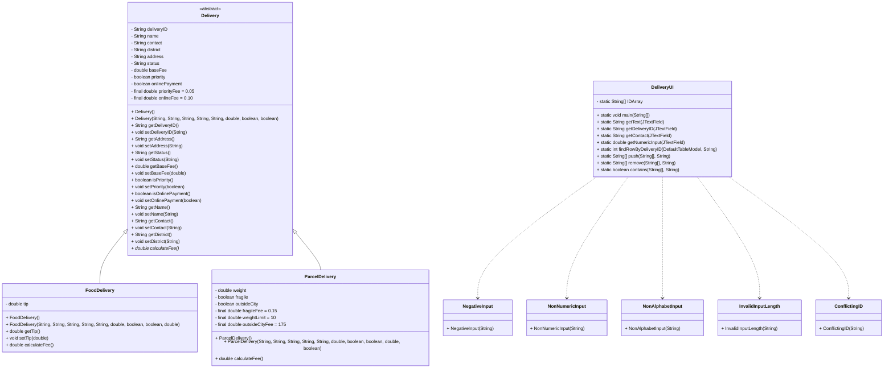

```mermaid
classDiagram

    class Delivery {
        <<abstract>>
        - String deliveryID
        - String name
        - String contact
        - String district
        - String address
        - String status
        - double baseFee

        - boolean priority

        - boolean onlinePayment

        - final double priorityFee = 0.05

        - final double onlineFee = 0.10

        + Delivery()

        + Delivery(String, String, String, String, String, double, boolean, boolean)

        + String getDeliveryID()

        + void setDeliveryID(String)

        + String getAddress()

        + void setAddress(String)

        + String getStatus()

        + void setStatus(String)

        + double getBaseFee()

        + void setBaseFee(double)

        + boolean isPriority()

        + void setPriority(boolean)

        + boolean isOnlinePayment()

        + void setOnlinePayment(boolean)

        + String getName()

        + void setName(String)

        + String getContact()

        + void setContact(String)

        + String getDistrict()

        + void setDistrict(String)

        + double calculateFee()*

    }

  

    class FoodDelivery {

        - double tip

        + FoodDelivery()

        + FoodDelivery(String, String, String, String, String, double, boolean, boolean, double)

        + double getTip()

        + void setTip(double)

        + double calculateFee()

    }

  

    class ParcelDelivery {

        - double weight

        - boolean fragile

        - boolean outsideCity

        - final double fragileFee = 0.15

        - final double weightLimit = 10

        - final double outsideCityFee = 175

        + ParcelDelivery()

        + ParcelDelivery(String, String, String, String, String, double, boolean, boolean, double, boolean)

        + double calculateFee()

    }

  

    class DeliveryUI {

        - static String[] IDArray

        + static void main(String[])

        + static String getText(JTextField)

        + static String getDeliveryID(JTextField)

        + static String getContact(JTextField)

        + static double getNumericInput(JTextField)

        + static int findRowByDeliveryID(DefaultTableModel, String)

        + static String[] push(String[], String)

        + static String[] remove(String[], String)

        + static boolean contains(String[], String)

    }

  

    class NegativeInput {

        + NegativeInput(String)

    }

  

    class NonNumericInput {

        + NonNumericInput(String)

    }

  

    class NonAlphabetInput {

        + NonAlphabetInput(String)

    }

  

    class InvalidInputLength {

        + InvalidInputLength(String)

    }

  

    class ConflictingID {

        + ConflictingID(String)

    }

  

    Delivery <|-- FoodDelivery

    Delivery <|-- ParcelDelivery

    DeliveryUI ..> NegativeInput

    DeliveryUI ..> NonNumericInput

    DeliveryUI ..> NonAlphabetInput

    DeliveryUI ..> InvalidInputLength

    DeliveryUI ..> ConflictingID
```
